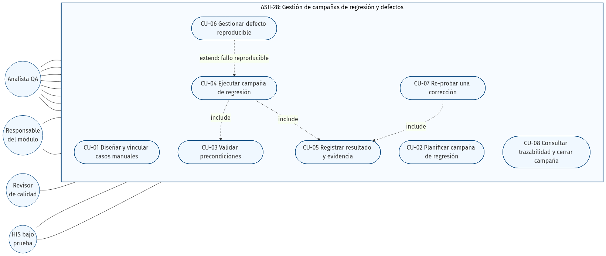

# ASII-28 - Semana 1: Diagrama de casos de uso

El diagrama delimita la gestión de campañas de regresión y defectos dentro de ASII-28.
Representa al Analista QA como actor principal y muestra las interacciones directas del
Responsable del módulo, el Revisor de calidad y el HIS bajo prueba.

## Relaciones principales

- CU-04 incluye CU-03 porque toda ejecución debe validar sus precondiciones.
- CU-04 incluye CU-05 porque toda ejecución debe registrar resultado y evidencia.
- CU-06 extiende CU-04 solamente cuando se detecta un fallo reproducible.
- CU-07 incluye CU-05 porque una re-prueba debe conservar evidencia nueva.

La fuente editable se encuentra en
[`05-diagrama-casos-de-uso.mmd`](05-diagrama-casos-de-uso.mmd).
