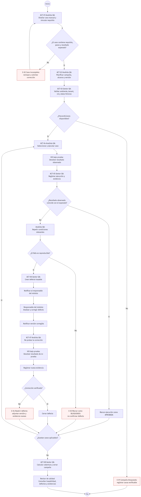

# ASII-28 - Semana 1: Diagrama de actividad

El diagrama representa el flujo de una campaña de regresión manual desde el diseño del
caso hasta el cierre de la campaña. Incluye las decisiones que validan la información
del caso, las precondiciones, el resultado observado, la reproducibilidad del fallo y la
verificación de una corrección.

## Decisiones y excepciones

- E-01 bloquea la campaña cuando faltan ambiente, versión o datos.
- E-02 devuelve un caso incompleto para que QA lo corrija.
- E-03 registra un bloqueo cuando el fallo no puede reproducirse.
- E-04 reabre el defecto cuando la corrección no resuelve el fallo.

La fuente editable se encuentra en
[`06-diagrama-actividad.mmd`](06-diagrama-actividad.mmd).
