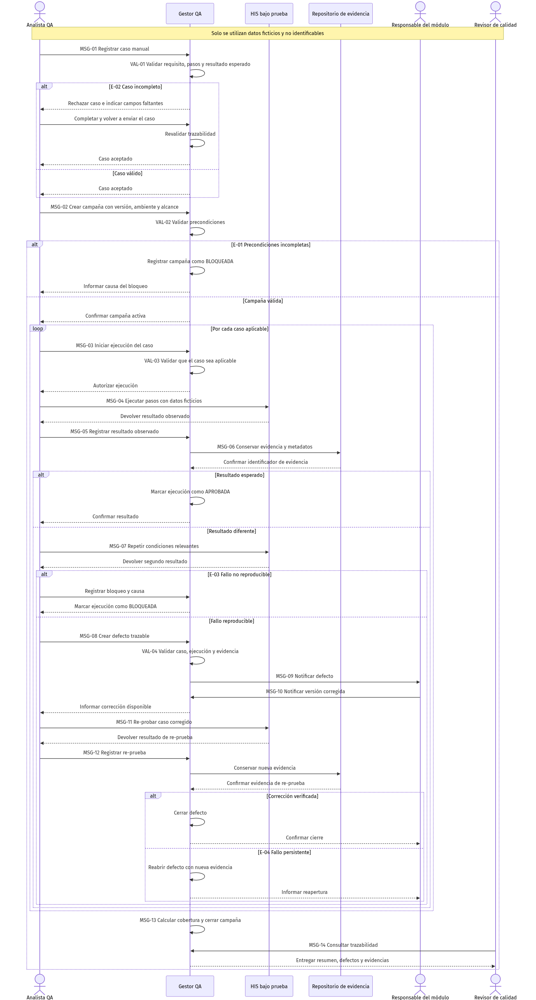

# ASII-28 - Semana 1: Diagrama de secuencia

El diagrama detalla los mensajes intercambiados durante la campaña entre el Analista QA,
el Gestor QA, el HIS bajo prueba, el Repositorio de evidencia, el Responsable del módulo
y el Revisor de calidad.

## Interacciones principales

- MSG-01 y VAL-01 registran y validan el caso manual.
- MSG-02 y VAL-02 crean la campaña y validan sus precondiciones.
- MSG-03 a MSG-06 ejecutan el caso y conservan evidencia.
- MSG-07 a MSG-09 confirman y notifican un defecto reproducible.
- MSG-10 a MSG-12 gestionan la corrección y su re-prueba.
- MSG-13 y MSG-14 cierran la campaña y permiten consultar su trazabilidad.

La fuente editable se encuentra en
[`07-diagrama-secuencia.mmd`](07-diagrama-secuencia.mmd).
