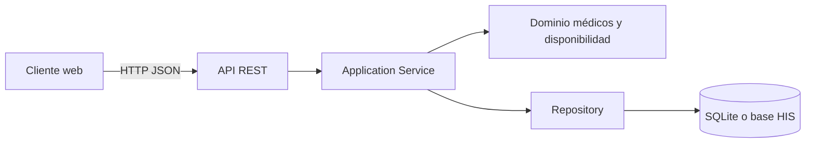

# Semana 5 - API REST y evaluación de microservicio

**Estudiante:** Billy Eduardo Cardona López  
**Módulo:** Médicos, especialidades y disponibilidad  
**Flujo:** registrar médico, asociar especialidad y consultar disponibilidad

## 1. Objetivo

Evolucionar el monolito por capas de las semanas 3 y 4 hacia un diseño cliente-servidor. La primera versión expone una API REST, pero conserva una sola aplicación y una base de datos local. También se evalúa si disponibilidad debe convertirse posteriormente en un microservicio.

## 2. Estado de partida

La implementación actual separa estas responsabilidades:

- **Presentación:** navegador y controlador.
- **Aplicación:** `AvailabilityService`, que coordina el caso de uso.
- **Dominio:** médico y bloque de disponibilidad.
- **Persistencia:** `DoctorAvailabilityRepositoryInterface` y adaptador PDO/SQLite.

Esta separación permite agregar una interfaz HTTP sin mover las reglas de negocio al controlador.

## 3. Arquitectura propuesta



La decisión es comenzar con un **monolito modular cliente-servidor**. La API será la frontera entre el cliente y el servidor; las capas internas continuarán siendo las mismas.

## 4. Contrato API

Todas las rutas usan el prefijo `/api/v1`, autenticación Bearer y el encabezado `X-Tenant-ID`.

| Método | Ruta | Permiso | Resultado principal |
|---|---|---|---|
| `POST` | `/doctors` | `doctors.create` | Registra un médico. |
| `GET` | `/doctors` | `doctors.read` | Lista médicos del tenant. |
| `GET` | `/doctors/{doctorId}` | `doctors.read` | Consulta un médico. |
| `POST` | `/doctors/{doctorId}/specialties` | `specialties.assign` | Asocia una especialidad. |
| `GET` | `/specialties` | `specialties.read` | Lista especialidades disponibles. |
| `POST` | `/doctors/{doctorId}/availability` | `availability.create` | Crea un bloque disponible. |
| `GET` | `/doctors/{doctorId}/availability` | `availability.read` | Consulta disponibilidad. |

### 4.1 Registrar médico

```http
POST /api/v1/doctors
Authorization: Bearer {token}
X-Tenant-ID: hospital-central
Content-Type: application/json
```

```json
{
  "license_number": "MED-0001",
  "first_name": "Andrea",
  "last_name": "Lopez",
  "email": "andrea.lopez@example.test"
}
```

Respuesta exitosa: `201 Created`.

```json
{
  "data": {
    "id": 1,
    "license_number": "MED-0001",
    "name": "Andrea Lopez",
    "email": "andrea.lopez@example.test",
    "status": "active"
  }
}
```

### 4.2 Asociar especialidad

```http
POST /api/v1/doctors/1/specialties
```

```json
{
  "specialty_id": 2
}
```

Respuesta exitosa: `201 Created`. Si la asociación ya existe, responder `409 Conflict`.

### 4.3 Crear disponibilidad

```http
POST /api/v1/doctors/1/availability
```

```json
{
  "date": "2026-09-21",
  "start_time": "08:00",
  "end_time": "12:00"
}
```

Respuesta exitosa: `201 Created`.

```json
{
  "data": {
    "id": 10,
    "doctor_id": 1,
    "date": "2026-09-21",
    "start_time": "08:00",
    "end_time": "12:00",
    "status": "available"
  }
}
```

Si el intervalo se cruza con otro bloque del mismo médico, responder `409 Conflict`:

```json
{
  "error": "availability_overlap",
  "message": "El horario se cruza con otro bloque del médico."
}
```

## 5. Errores y seguridad

| Código | Significado |
|---:|---|
| `400` | Solicitud mal formada. |
| `401` | Token ausente o inválido. |
| `403` | El usuario no tiene el permiso requerido. |
| `404` | Médico o especialidad inexistente. |
| `409` | Conflicto de horario o asociación duplicada. |
| `422` | Datos que no cumplen validaciones. |
| `500` | Error inesperado del servidor. |

Medidas de seguridad:

- Validar el JWT antes del controlador.
- Verificar que `X-Tenant-ID` coincida con el tenant del usuario.
- Filtrar cada consulta por tenant.
- No permitir acceso directo del cliente a la base de datos.
- No enviar datos de pacientes ni información clínica en este módulo.
- Usar `Idempotency-Key` en creaciones cuando exista riesgo de reintento.

## 6. Propiedad de datos

| Dato | Propietario | Otros módulos |
|---|---|---|
| Médico | Módulo de médicos | Consultan mediante API. |
| Especialidad | Catálogo de especialidades | Consultan mediante API. |
| Asociación médico-especialidad | Módulo de médicos | No escriben directamente. |
| Disponibilidad | Módulo de disponibilidad | Consultan mediante API. |
| Citas | Módulo de citas | Consume disponibilidad; no la modifica directamente. |

## 7. Resiliencia y observabilidad

- Aplicar timeout a llamadas HTTP externas.
- Reintentar únicamente lecturas o solicitudes idempotentes.
- No reintentar automáticamente un `POST` sin `Idempotency-Key`.
- Incluir `request_id` en logs y respuestas de error.
- Registrar endpoint, duración, usuario, tenant y resultado HTTP.
- Devolver `503 Service Unavailable` si una dependencia no responde.
- Aplicar fail-closed en autorización: ante una duda, se deniega el acceso.

## 8. Frontera de microservicio evaluada

La frontera candidata es **Availability Service**. Sería dueño de la creación, consulta y validación de bloques de disponibilidad.

### Beneficios

- Escalamiento independiente si las consultas crecen.
- Regla de solapamiento concentrada en un solo componente.
- Contrato estable para citas y otros consumidores.

### Costos

- Comunicación HTTP y posibles timeouts.
- Consistencia distribuida.
- Más despliegues, logs y pruebas de integración.
- Necesidad de evitar copias desactualizadas de médicos y especialidades.

### Decisión

No se extrae el microservicio todavía. Primero se mantiene el monolito modular y se mide el uso. Se considerará la extracción si existen al menos tres consumidores, si disponibilidad supera el 60% del tráfico del módulo o si necesita escalar y desplegarse independientemente.

## 9. Migración razonada

1. Mantener las entidades, servicios y Repository actuales.
2. Agregar controladores REST delgados.
3. Reutilizar `AvailabilityService` para conservar la regla de solapamiento.
4. Estandarizar respuestas JSON y errores.
5. Proteger rutas con JWT, permisos y tenant.
6. Agregar pruebas de contrato y de conflicto de horarios.
7. Medir tráfico, latencia y errores antes de separar disponibilidad.
8. Si la medición lo justifica, extraer el servicio y conservar el mismo contrato API.

## 10. Criterios de aceptación

- [ ] El cliente puede registrar un médico por HTTP.
- [ ] El cliente puede asociar una especialidad.
- [ ] El cliente puede consultar disponibilidad.
- [ ] Un horario superpuesto se rechaza con `409`.
- [ ] Una petición sin token responde `401`.
- [ ] Un usuario sin permiso responde `403`.
- [ ] Un tenant no puede consultar datos de otro tenant.
- [ ] La decisión de no extraer todavía un microservicio está justificada con métricas.
