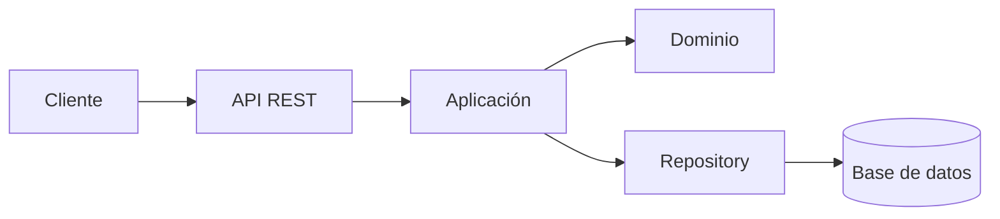

# Semana 6 - Defensa de arquitectura y primera evaluación parcial

**Estudiante:** Billy Eduardo Cardona López  
**Módulo:** Médicos, especialidades y disponibilidad  
**Formato sugerido:** 8 diapositivas

## Diapositiva 1 - Contexto y flujo

**Título:** Médicos, especialidades y disponibilidad

El módulo permite registrar médicos, asociarlos con especialidades y consultar bloques de disponibilidad para que otros procesos del HIS puedan utilizar esa información.

Flujo defendido:

```text
Registrar médico -> Asociar especialidad -> Registrar disponibilidad -> Consultar disponibilidad
```

La arquitectura propuesta es cliente-servidor mediante API REST, manteniendo inicialmente un monolito modular.

## Diapositiva 2 - Actores y alcance

| Actor | Interacción |
|---|---|
| Administrador | Registra médicos y administra especialidades. |
| Médico | Consulta o mantiene sus bloques autorizados. |
| Recepcionista | Consulta disponibilidad para futuras citas. |
| Sistema de citas | Consume disponibilidad mediante API. |
| Servicio de autenticación | Entrega identidad, tenant y permisos. |

Dentro del alcance están médicos, especialidades, horarios y conflictos. Pacientes, citas y expedientes pertenecen a otros módulos.

## Diapositiva 3 - Requisitos y arquitectura

Requisitos funcionales principales:

- **RF-01:** registrar un médico.
- **RF-02:** asociar una especialidad.
- **RF-03:** registrar disponibilidad.
- **RF-04:** consultar disponibilidad.
- **RF-05:** rechazar horarios superpuestos.

Requisitos no funcionales principales:

- Seguridad con JWT, permisos y tenant.
- Respuesta JSON consistente.
- Mantenibilidad por capas.
- Trazabilidad mediante logs y `request_id`.
- Disponibilidad y manejo de errores.



## Diapositiva 4 - Contrato API

Ejemplo de creación de disponibilidad:

```http
POST /api/v1/doctors/1/availability
Authorization: Bearer {token}
X-Tenant-ID: hospital-central
```

```json
{
  "date": "2026-09-21",
  "start_time": "08:00",
  "end_time": "12:00"
}
```

Respuestas esperadas:

- `201 Created`: bloque guardado.
- `401 Unauthorized`: falta autenticación.
- `403 Forbidden`: falta permiso.
- `409 Conflict`: existe solapamiento.
- `422 Unprocessable Entity`: datos inválidos.

## Diapositiva 5 - Capas y SOLID

| Concepto | Aplicación en el módulo |
|---|---|
| Presentation | Recibe HTTP y devuelve JSON. |
| Application | Coordina el caso de uso. |
| Domain | Contiene médico, especialidad y disponibilidad. |
| Persistence | Ejecuta consultas mediante PDO/SQLite. |
| SRP | Cada clase tiene una responsabilidad concreta. |
| DIP | El servicio depende de una interfaz Repository. |
| OCP | Se pueden agregar adaptadores sin cambiar el servicio. |

El controlador no debe ejecutar SQL ni decidir si dos horarios se cruzan.

## Diapositiva 6 - Repository y trazabilidad

La aplicación depende de:

```text
DoctorAvailabilityRepositoryInterface
```

El adaptador concreto puede ser:

```text
PdoDoctorAvailabilityRepository
```

Esto permite cambiar SQLite por otra base de datos o usar un repositorio en memoria durante pruebas sin modificar la regla de negocio.

Trazabilidad:

| Elemento anterior | Elemento de esta propuesta |
|---|---|
| Caso de uso de disponibilidad | `POST /doctors/{id}/availability` |
| Regla de no solapamiento | `AvailabilityService` |
| Persistencia desacoplada | Repository |
| Control de acceso | JWT, permisos y tenant |
| Consulta desde otros módulos | API REST |

## Diapositiva 7 - Cambio práctico defendido

**Cambio:** el médico ya tiene disponibilidad de 08:00 a 12:00 para el 21 de septiembre. Se intenta crear otro bloque de 10:00 a 13:00 en la misma fecha.

Flujo:

```text
Controller -> AvailabilityService -> Repository -> Base de datos
```

Resultado:

```http
409 Conflict
```

```json
{
  "error": "availability_overlap",
  "message": "El horario se cruza con otro bloque del médico."
}
```

La validación debe ejecutarse en el servidor y en el propietario de disponibilidad. El cliente no puede decidir por sí solo si el horario es válido.

## Diapositiva 8 - Decisión y evidencia

Decisión final:

> Se adopta un monolito modular cliente-servidor y se prepara la frontera de un posible `Availability Service`. No se divide en microservicios hasta contar con una necesidad medible.

Evidencias:

- Contrato API: `semana-05-api-y-microservicio.md`.
- Capas y Repository: `razonamiento-arquitectonico.md`.
- Componentes: `diagramas/01-componentes.mmd`.
- Secuencia: `diagramas/02-secuencia.mmd`.
- Ejecución y datos ficticios: `evidencia.md`.
- Issue, rama, worktree y PR: enlaces de GitHub.

## Matriz decisión -> evidencia

| Decisión | Razón | Evidencia que se muestra |
|---|---|---|
| Exponer API REST | Separa cliente y servidor | Contrato HTTP/JSON |
| Mantener monolito modular | Reduce costo inicial | Diagrama de capas |
| Usar Repository | Aísla persistencia | Interfaz y adaptador |
| Validar conflictos en servidor | Es regla de negocio | Caso práctico `409` |
| Proteger con JWT y tenant | Evita acceso indebido | Encabezados y permisos |
| No extraer todavía | Falta beneficio medible | Criterios de extracción |
| Evaluar Availability Service | Tiene responsabilidad cohesionada | Frontera propuesta |

## Preguntas que debes poder responder

### ¿Por qué no construir microservicios inmediatamente?

Porque el módulo es pequeño, tiene un solo despliegue y todavía no demuestra suficiente carga o independencia operativa. Dividirlo agregaría latencia, consistencia distribuida y complejidad de despliegue.

### ¿Dónde vive la regla de solapamiento?

En el servicio de aplicación y en la persistencia usada para verificar el bloque. El endpoint solo traduce HTTP y no contiene la regla.

### ¿Qué ocurre si el cliente intenta saltarse la validación?

El servidor vuelve a validar la solicitud. El cliente nunca es una autoridad de seguridad ni de consistencia.

### ¿Qué pasa si mañana cambia SQLite?

Se reemplaza el adaptador Repository. El servicio de aplicación conserva el mismo contrato.
