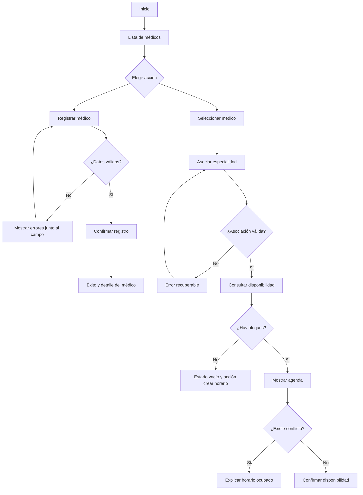

# Semana 8 - Diseño de experiencia de usuario

## Roles autorizados

| Rol | Puede hacer |
|---|---|
| Administrador | Registrar médicos, asociar especialidades y consultar disponibilidad. |
| Médico | Consultar sus datos y disponibilidad autorizada. |
| Recepción | Consultar disponibilidad; no modifica médicos ni especialidades. |

## User flow del administrador



## Wireframes anotados

### 1. Lista de médicos

```text
+------------------------------------------------+
| Médicos                         [Registrar]     |
| Buscar médico [____________]  Especialidad [v] |
|                                                |
| Andrea Lopez     Medicina Interna   [Ver]      |
| Carlos Mejia     Cardiología        [Ver]      |
|                                                |
| Estado: cargando / vacío / resultados          |
+------------------------------------------------+
```

- El botón `Registrar` solo aparece con permiso.
- La búsqueda no expone información clínica.
- El foco visible debe permanecer en el control usado.

### 2. Registro de médico

```text
+---------------------------------------+
| Registrar médico                  [X] |
| Nombre completo [___________________] |
| Licencia       [___________________] |
| Especialidad   [Seleccionar       v]  |
|                                       |
| [Cancelar]                 [Guardar]  |
+---------------------------------------+
```

- Validar campos obligatorios antes de enviar.
- No borrar los datos si el servidor responde un error recuperable.
- Confirmar antes de guardar si el formulario fue modificado.

### 3. Asociación de especialidad

```text
+---------------------------------------+
| Andrea Lopez                          |
| Especialidades actuales:              |
| Medicina Interna                      |
| Agregar especialidad [Cardiología v]  |
| [Cancelar]                 [Asociar]  |
+---------------------------------------+
```

- Evitar duplicados y explicar el conflicto en el mismo contexto.

### 4. Consulta de disponibilidad

```text
+---------------------------------------+
| Andrea Lopez - Medicina Interna       |
| Fecha [21/09/2026]       [Consultar]  |
|                                       |
| 08:00 - 12:00  Disponible             |
| 14:00 - 16:00  Bloqueado              |
+---------------------------------------+
```

- Mientras consulta: mostrar `Cargando disponibilidad...`.
- Sin datos: mostrar `No hay bloques para esta fecha` y `Cambiar fecha`.

### 5. Conflicto de horario

```text
+---------------------------------------+
| No se puede guardar                   |
| El horario 10:00-13:00 se cruza con  |
| el bloque existente 08:00-12:00.     |
|                                       |
| [Cambiar horario]        [Cerrar]     |
+---------------------------------------+
```

- Error específico, no genérico.
- Conservar fecha y horas para corregirlas.
- No revelar datos de otros pacientes o módulos.

## Estados globales

| Estado | Mensaje | Acción |
|---|---|---|
| Carga | `Cargando médicos...` | Esperar o cancelar si aplica. |
| Vacío | `No hay médicos registrados.` | `Registrar médico`. |
| Éxito | `Médico guardado correctamente.` | Ver detalle. |
| Error recuperable | `La licencia ya está registrada.` | Corregir licencia. |
| Error de red | `No se pudo conectar.` | `Reintentar`. |
| Sin permiso | `No tienes autorización para esta acción.` | Volver a la lista. |
