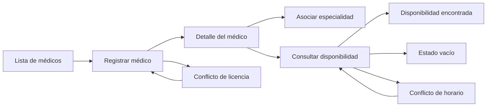

# Semana 11 - Prototipo navegable desktop y móvil

## Archivo del prototipo

El prototipo funcional está en:

- `docs/medicos/prototipo/index.html`
- `docs/medicos/prototipo/prototipo.css`

Se puede abrir directamente en el navegador porque no depende de PHP ni de una API real.

## Mapa de navegación

## Estados cubiertos

### Camino feliz

1. Abrir lista de médicos.
2. Seleccionar `Andrea Lopez`.
3. Abrir disponibilidad.
4. Consultar el 21 de septiembre de 2026.
5. Visualizar bloques disponibles.

### Error crítico

1. Abrir `Registrar disponibilidad`.
2. Introducir 10:00 a 13:00.
3. El prototipo muestra el conflicto con el bloque 08:00 a 12:00.
4. Pulsar `Cambiar horario`.
5. El formulario conserva los datos para corregirlos.

## Validación desktop y móvil

- Desktop: abrir con ancho aproximado de 1366 px.
- Móvil: usar DevTools con 320 px o 390 px.
- Comprobar que las tarjetas se apilen y no aparezca scroll horizontal.
- Pulsar `Tab` para revisar el foco.
- Activar el error para revisar que sea específico y recuperable.

## Evidencia que se debe capturar

- Lista de médicos en desktop.
- Consulta de disponibilidad en desktop.
- Registro de disponibilidad en móvil.
- Error de conflicto en móvil.
- Vista de la estructura `docs/medicos/prototipo/` en GitHub.
