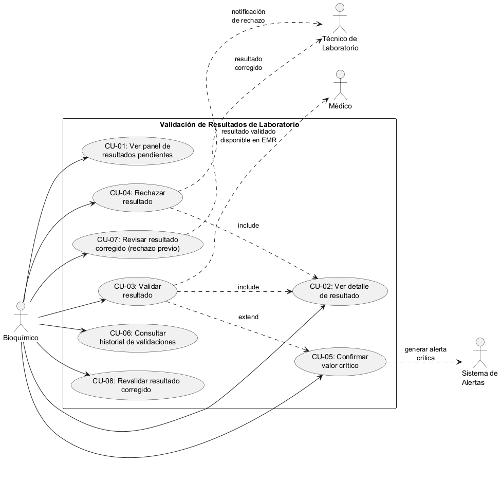
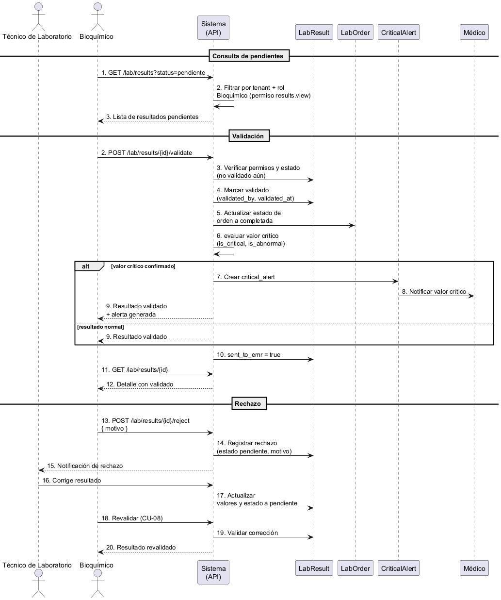
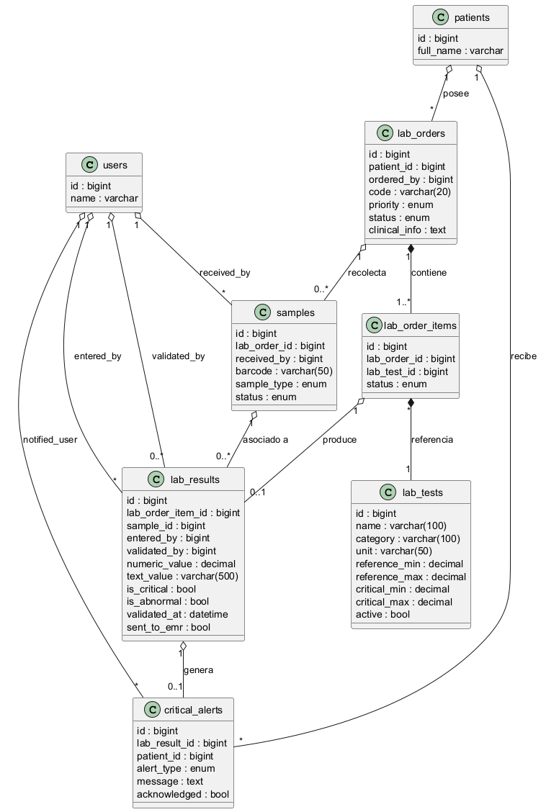

# Módulo 20 — Validación de resultados por bioquímico

## Semana 1: Actores, alcance y casos de uso

### Actores

| Actor | Descripción |
|---|---|
| **Bioquímico** | Actor principal. Revisa, valida o rechaza resultados de laboratorio. |
| **Técnico de Laboratorio** | Ingresa los resultados al sistema. Recibe notificaciones cuando un resultado es rechazado o corregido. |
| **Médico** | Consulta los resultados validados desde el expediente del paciente. |
| **Sistema de Alertas** | Actor secundario automatizado. Genera alertas cuando se confirma un valor crítico. |

### Casos de uso

| # | Caso de uso | Actor | Descripción breve |
|---|---|---|---|
| CU-01 | Ver panel de resultados pendientes | Bioquímico | Lista filtrada de resultados con estado pendiente ordenados por prioridad y fecha. |
| CU-02 | Ver detalle de resultado | Bioquímico | Muestra valores del resultado, rangos de referencia, flags de anormal/crítico, datos del paciente y de la orden. |
| CU-03 | Validar resultado | Bioquímico | Aprueba el resultado; se guardan validated_by, validated_at y cambia estado a validado. |
| CU-04 | Rechazar resultado | Bioquímico | Rechaza el resultado con un motivo; se notifica al técnico para corrección. |
| CU-05 | Confirmar valor crítico | Bioquímico | Al validar un resultado crítico, el bioquímico confirma la criticalidad y se genera una alerta. |
| CU-06 | Consultar historial de validaciones | Bioquímico | Lista resultados previamente validados o rechazados por el bioquímico, con filtros por fecha y paciente. |
| CU-07 | Revisar resultado corregido | Bioquímico | Revisa un resultado que fue rechazado previamente y corregido por el técnico. |
| CU-08 | Revalidar resultado corregido | Bioquímico | Vuelve a validar o rechazar un resultado que pasó por corrección. |

### Actores y casos de uso

Detalle completo en [actores-casos-de-uso.md](./actores-casos-de-uso.md).

### Alcance y límites

Ver [narrativa-alcance.md](./narrativa-alcance.md).

## Semana 2: Requerimientos y SOLID

- [Requerimientos funcionales y no funcionales](./rf-rnf.md)
- [Ejemplo SOLID (Open/Closed)](./solid.md)

## Diagramas UML

**Diagrama de casos de uso** (`casos-de-uso.puml`):

**Diagrama de secuencia** — flujo de validación/rechazo (`diagrama-secuencia.puml`):

**Diagrama de clases** — modelo de laboratorio (`diagrama-clases.puml`):

> Todos los diagramas se generan desde sus archivos `.puml` usando PlantUML.
