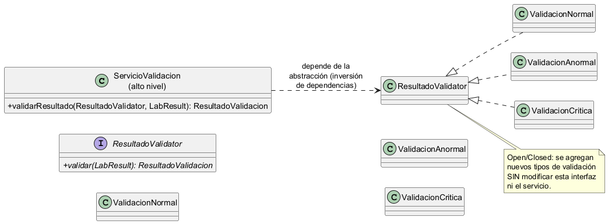

# Módulo 20 — Ejemplo SOLID aplicado

## Semana 2: Principio Open/Closed

**Fuente:** [Principios básicos del diseño de software – MVP Cluster](https://mvpcluster.com/diseno-de-software-2/)

### Contexto

En el módulo de validación de resultados por bioquímico, un resultado de laboratorio puede presentarse en distintos escenarios según su valor y su flag:

- Resultado **normal**: cumple los rangos de referencia.
- Resultado **anormal**: fuera de rango, requiere revisión.
- Resultado **crítico**: supera los umbrales críticos y exige generar una `critical_alert`.

Si la lógica de validación se concentra en una sola clase con `if/else` por cada tipo, cualquier nueva variante de validación obligaría a modificar esa clase. Eso viola el principio **Open/Closed**: una clase debe estar abierta a la extensión pero cerrada a la modificación.

### Problema (anti-patrón)

```php
class BioquimicoValidator
{
    public function validar(LabResult $r)
    {
        if ($r->is_critical) {
            // lógica de validación crítica...
        } elseif ($r->is_abnormal) {
            // lógica de validación anormal...
        } else {
            // lógica de validación normal...
        }
    }
}
```

Agregar un nuevo tipo de validación (por ejemplo, valores pediátricos) implica **modificar** `BioquimicoValidator`, aumentando el riesgo de romper lo que ya funciona y generando un mantenimiento costoso.

### Solución (Open/Closed)

Se define una interfaz `ResultadoValidator` con una sola operación `validar(LabResult $r): ResultadoValidacion`. Cada tipo de validación se implementa en una clase separada que hereda de la interfaz. El alto nivel (servicio que orquesta la validación) depende de la abstracción `ResultadoValidator`, no de los detalles.

```php
interface ResultadoValidator
{
    public function validar(LabResult $r): ResultadoValidacion;
}

class ValidacionNormal implements ResultadoValidator
{
    public function validar(LabResult $r): ResultadoValidacion
    {
        // Marca como validado sin alerta.
    }
}

class ValidacionAnormal implements ResultadoValidator
{
    public function validar(LabResult $r): ResultadoValidacion
    {
        // Marca como validado y establece is_abnormal = true.
    }
}

class ValidacionCritica implements ResultadoValidator
{
    public function validar(LabResult $r): ResultadoValidacion
    {
        // Marca como validado y dispara critical_alert.
    }
}
```

**Beneficio:** para agregar un nuevo tipo de validación basta crear una nueva clase que implemente `ResultadoValidator`. No se modifica el código existente: la clase está **abierta a la extensión** y **cerrada a la modificación**, cumpliendo el principio Open/Closed de la fuente citada.

### Diagrama de clases del patrón



> Diagrama generado desde `solid-open-closed.puml` usando PlantUML.

## Referencia

- MVP Cluster. *Principios básicos del diseño de software*. https://mvpcluster.com/diseno-de-software-2/